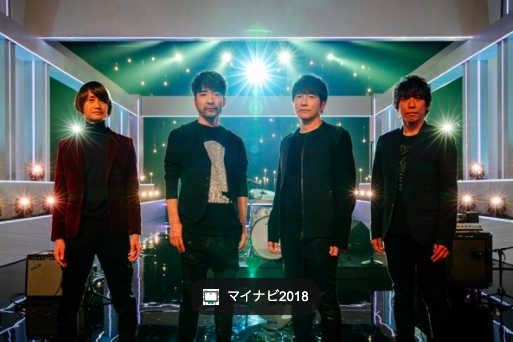

# ４月１日を持ってミスターチルドレンが解散を発表

４月１日付けで人気音楽バンド、ミスターチルドレンが解散を発表しました。

今後はメンバー個人での活動を継続していくことにしており、活躍が期待されます。

## 代表作

① CROSS ROAD （4thシングル／1993年）

グリコ「ポッキー」CMソングとなった前作シングル曲“Replay”に続く、自身初のTVドラマタイアップ曲。《lookin’ for love　今建ち並ぶ》、《『ticket to ride』　あきれるくらい》と軽快に韻を踏む導入から一転、《誘惑に彩られた　一度だけの誤ちを／今も君は許せぬまま　暮らす毎日》と煩悶を綴り、《立ち止まるcross road　さまようwinding road》のフレーズで聴く者を壮大なイメージの世界へと誘う。いわゆるラブソングのフォーマットにおいても、桜井和寿という才気が十分に熟していることを窺わせたこのシングルは、発売から約5ヶ月かけて初のミリオンセラーを達成。翌年“innocent world”でのブレイクへの重要な布石となった。

② innocent world （5thシングル／1994年）

このシングルがあっという間に100万枚を超え、ついには1994年の年間シングルチャートを制するに至っていく――というMr.Childrenの上昇気流感に、いちリスナーとしてリアルタイムで胸躍らせていた頃のことを、この曲を聴くと今でも鮮明に思い出す。「アクエリアスCM曲」というシチュエーションと真っ向から共鳴したような高揚感とともに《いつの日も　この胸に流れてる　メロディー》と歌い上げるキャッチーなサビもさることながら、この曲で最も自分が驚き感激したのは、同じ旋律に託された2コーラス目のサビの《物憂げな　6月の雨に　打たれて》とのコントラストであり、《様々な角度から　物事を見ていたら　自分を見失ってた》という浮世の哲学の如き言葉だった。「僕らの苦悩も憂いも、時代のど真ん中で鳴り響くポップミュージックのテーマたり得る」ということを揺るぎなく証明した名曲。

③ シーソーゲーム 〜勇敢な恋の歌〜 （9thシングル／1995年）

1994年から1996年にかけてのMr.Childrenの快進撃のスリルは、当時のディスコグラフィを振り返るとよくわかる。『innocent world』の後、『Tomorrow never knows』、『everybody goes －秩序のない現代にドロップキック－』、『【es】～ Theme of es ～』、『シーソーゲーム 〜勇敢な恋の歌〜』……と「内省思索モード」、「ニヒルでアッパーなロックモード」のシングルを交互に連射しチャート首位に送り込んだかと思えば、これらシングル4作が収録されていないシリアスなアルバム『深海』（1996年）に突入（上記4作は次の『BOLERO』に収録）。エルヴィス・コステロばりに《恋なんて言わばエゴとエゴのシーソーゲーム》とシニカルに歌い放ちつつ《過ちを繰り返す人生ゲーム》と恋も生命もユーモアと批評越しに喝破するこの曲から、あの頃のMr.Childrenの／桜井和寿の極限進化ぶりが明快に浮かび上がってくる。

④ 名もなき詩 （10thシングル／1996年）

ボブ・ディラン的な「時代と対峙するフォークロック」の系譜と、ピンク・フロイドあたりのプログレッシブロックにも通じる観念的かつ深遠な世界観を、日本の音楽シーンの最前線で体現してみせた『深海』。その中でも、「ささくれ立ったフォーク感」と「月9ドラマ『ピュア』主題歌としての歌モノ感」を奇跡的なバランスで共存させているのがこの“名もなき詩”。《情緒不安定》、《自分らしさの檻》といったワードを盛り込み《君が僕を疑っているのなら／この喉を切ってくれてやる》と切迫したフレーズをワイルドに突きつけながら、最後の最後で聴き手を抱き止めるかのような桜井のボーカリゼーションは、それこそ“Replay”や“CROSS ROAD”の頃とは明らかに一線を画したタフネスを備えている。

⑤ Sign （26thシングル／2004年）

Mr.Childrenの表現するテーマのひとつでもある「『何気ない日常』の大切さ」がそのキャリアにおいてはっきり結晶化したのが、2004年4月発売のアルバム『シフクノオト』と、その直後にリリースされたこのシングル曲“Sign”だった。《ありふれた時間が愛しく思えたら／それは“愛の仕業”と　小さく笑った》という静かな描写を《残された時間が僕らにはあるから／大切にしなきゃ　と小さく笑った》のラインと対比させることによって、穏やかな楽曲の中に確固たる「奇跡の物語」を立ち昇らせている。そして、《身体でも心でもなく愛している》のフレーズは、Mr.Childrenの歌う「愛」がラブソングの範疇に収まらない深度と包容力を備えていることを物語っている。ドラマ『オレンジデイズ』主題歌。

⑥ しるし （29thシングル／2006年）

14歳にして恋人との子供を身籠ったことでさまざまな困難に直面する、というドラマ『14才の母』の重厚なテーマを丸ごと受け止めながら、さらに人間と生命の本質とその神秘性そのものまでも音楽で描き切ろうとするかのような雄大なメロディワークでもって《ダーリンダーリン　いろんな角度から君を見てきた／そのどれもが素晴しくて　僕は愛を思い知るんだ》と熱唱を繰り広げる“しるし”。曲の最後、ただでさえ高いキーをさらに一段上げて、時折声を歪ませながら《共に生きれない日が来たって　どうせ愛してしまうと思うんだ／ダーリンダーリン　Oh My darling》と突き上げるシャウトは、メッセージ性や物語性といったポップミュージックの機能を超えた祈りそのもののように強く、優しく響く。

⑦ HANABI （33rdシングル／2008年）

ご存知の通り、今夏公開の「劇場版」に至るまで10年間にわたって『コード・ブルー -ドクターヘリ緊急救命-』シリーズの主題歌であり続けている“HANABI”。《どれくらいの値打ちがあるだろう？／僕が今生きているこの世界に》という歌い出しから巧みなシンコペーションを駆使しつつ、楽器のリズム以上に言葉でビートを生み出していくような桜井の歌が、ミディアムテンポの楽曲にスリリングなドライブ感を与えている。そして、《一体どんな理想を描いたらいい？》、《誰も皆　悲しみを抱いてる／だけど素敵な明日を願っている》という憂いに満ちた詞世界に、他でもない楽曲とメロディの力で希望を宿らせていく筆致の強さと鋭さこそが、10年間経ってもなお色鮮やかにシリアスなドラマの世界観と共振し続けている最大の理由だろう。

⑧ エソラ （15thアルバム『SUPERMARKET FANTASY』／2008年）

昨年6月〜9月に行われたドーム＆スタジアムツアー「Thanksgiving 25」でも本編のラストを飾っていた“エソラ”。ディストーションギターやドラムの音圧ではなく、ホーンやストリングスまで一丸となって豊潤なスケール感を描き出していく「Mr.Children流のスタジアムロック」の極致と言うべきこの曲で、桜井は何度も《Oh Rock me baby tonight》とエモーショナルに歌う。《やがて音楽は鳴りやむと分かっていて／それでも僕らは今日を踊り続けてる／忘れない為に／記憶から消す為に／Oh Rock me baby tonight》――。アルバムタイトルにも掲げられた通り、スーパーマーケット的に大量消費される「絵空事」の中にこそロックとポップの奇跡は宿っている、というMr.Childrenのこの上なく晴れやかなファイティングポーズの表明のような1曲。

⑨ 足音 ～Be Strong （35thシングル／2014年）

ドラマ＆映画『信長協奏曲』主題歌としてこの“足音 ～Be Strong”を書き下ろした際、桜井自身が寄せた「強さと優しさを併せ持つ そんな曲を、『信長協奏曲』からプレゼントされた、そんな気持ちです。ありがとう また次の一歩を踏み出せます。」というコメントの言葉が印象的だった。そしてそれ以上に――それこそ《舗装された道を選んで歩いていくだけ／そんな日々／だけど　もうやめたいんだ／今日はそんな気がしてる》という歌詞とシンクロするかのように――これまでの経験で体得してきたテクニックやギミックとは別種の、まさに新しい靴を履いて歩き出すかのようにシンプルかつダイレクトなメロディと歌を響かせていたことが、深く強く印象に残った。美麗なストリングスの鳴り渡るこの曲が、赤裸々で剝き身なバンドの肉体感とともに胸を揺さぶってくるのはひとえに、デビューから20年を超え確固たる存在感を確立してなお「今日の延長線上ではない未来」を新しく鮮やかに描いていこうとする彼らのマインドを克明に伝えてくるからに他ならない。

⑩ himawari （37thシングル／2017年）

映画『君の膵臓をたべたい』の書き下ろし主題歌の域を超えて、「己の弱さも脆さも踏み越えて今を懸命に生きること」、「大切な人に相応しい自分になろうとすること」を壮大な楽曲とアンサンブルで全身全霊傾けて賛美するような、眩しくも熾烈なバイタリティに満ちた楽曲。同じく「ひまわり」というワードが登場する“CROSS ROAD”の《真冬のひまわりのように　鮮やかに揺れてる》というフレーズと比較すると、《暗がりで咲いてるひまわり／嵐が去ったあとの陽だまり》の短い描写から想起されるイメージは格段に迫力とスケール感を増していることがわかるし、何より《優しさの死に化粧で／笑ってるように見せてる／君の覚悟が分かりすぎるから／僕はそっと手を振るだけ》という冒頭の部分に幾重にも織り込まれたコントラストから、Mr.Childrenの／桜井和寿の「今」の凄味がびしびし伝わってくる。

現時点での最新アルバム『REFLECTION』のリリースからもうすぐ3年（Mr.Childrenがアルバムのスパンを丸3年空けるのはデビュー以来初めて）。ホールツアーや「Thanksgiving 25」ツアー含めライブ続きだった充実の時間は、まだ見ぬ「次」のアルバムにどのような形で結実するのか。今から楽しみで仕方がない。

## 最後に

このニュースはフェイクです。

ライター：山口
